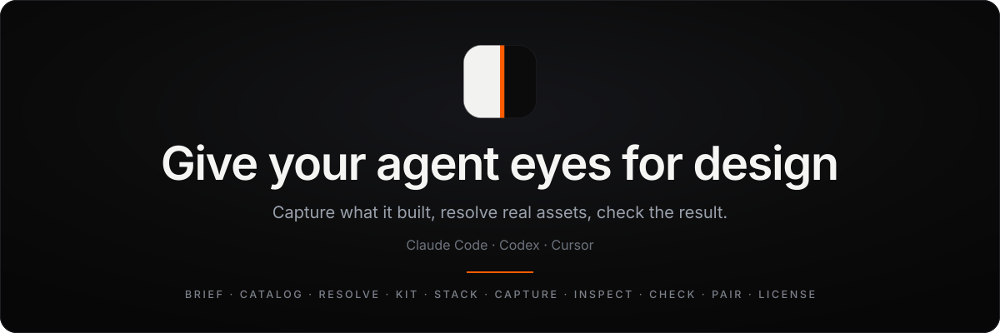
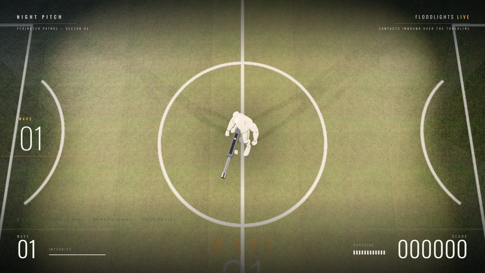
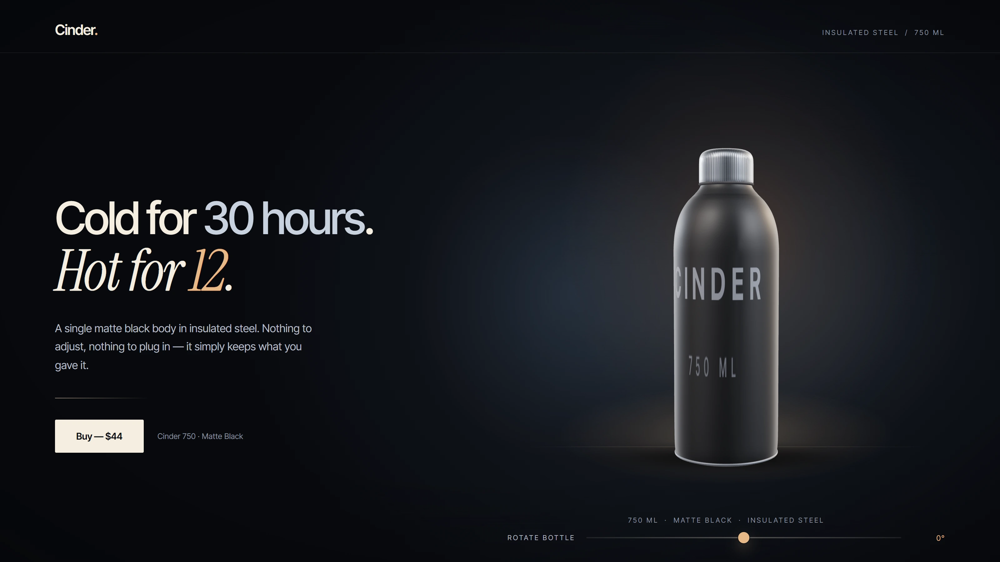
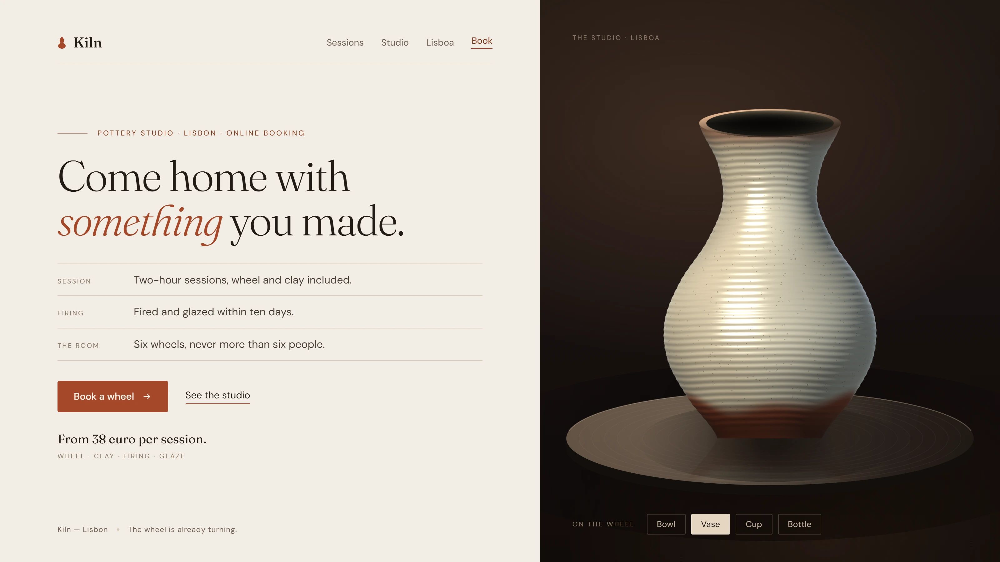

<p align="center">
  
</p>

<h1 align="center">Plate</h1>

<p align="center">
  <b>Give your coding agent eyes for design.</b>
</p>

<p align="center">
  <a href="docs/QUICKSTART.md">Quickstart</a> ·
  <a href="docs/TOOLS.md">Tools</a> ·
  <a href="docs/INSTALL.md">Install</a> ·
  <a href="https://plate-pro-nu.vercel.app/">Website</a>
</p>

<p align="center">
  
</p>

Give your agent a clear view of what it builds. Plate it screenshots the running project in an isolated browser and hands the actual image back, gives the agent a repeatable improvement loop over that evidence, and finds real licensed material for the things a brief asks for instead of leaving placeholders behind.

It is a local MCP server for Claude Code, Codex and Cursor. It does not call a model, does not upload your project, and does not judge whether a design is good. The judgment stays with your agent and with you.

## Built with Plate Pro

<p align="center">
  <a href="https://plate-pro-nu.vercel.app/examples/game-arena/after.html">
    
  </a>
</p>

**Night Pitch** — a playable floodlit arena, keyboard and on-screen touch controls, real stadium turf and a rigged character. Its complete implementation is included in Plate Pro. [Play it](https://plate-pro-nu.vercel.app/examples/game-arena/after.html)

These are demonstrations from the Plate example set, not benchmarks, and not something the free Starter produces for you. The Starter gives your agent the evidence loop and the material; Pro adds the systems and worked implementations behind these examples.

<table>
  <tr>
    <td width="50%"><a href="https://plate-pro-nu.vercel.app/examples/3d-bottle/after.html"></a></td>
    <td width="50%"><a href="https://plate-pro-nu.vercel.app/examples/web-kiln/after.html"></a></td>
  </tr>
  <tr>
    <td><b>Cinder 750</b> — product page, real environment light. <a href="https://plate-pro-nu.vercel.app/examples/3d-bottle/after.html">Open it</a></td>
    <td><b>Kiln</b> — pottery studio landing page. <a href="https://plate-pro-nu.vercel.app/examples/web-kiln/after.html">Open it</a></td>
  </tr>
</table>

## Install

Install into an isolated virtual environment; your agent will be pointed at that interpreter.

```sh
git clone https://github.com/ohad6k/plate.git
cd plate
python -m venv .venv
source .venv/bin/activate        # Windows: .venv\Scripts\activate
python -m pip install .
python -m plate_toolkit doctor
```

Python 3.11 or newer. For screenshots, add `python -m pip install playwright` and `python -m playwright install chromium` in the same environment.

## Connect your agent

Print the snippet for your client and merge it into that client's config. The command only prints; it never edits your files.

```sh
python -m plate_toolkit config claude    # or codex, or cursor
```

Claude Code (`.mcp.json`) and Cursor (`.cursor/mcp.json`):

```json
{
  "mcpServers": {
    "plate": {
      "command": "/path/to/plate/.venv/bin/python",
      "args": ["-m", "plate_toolkit", "mcp"]
    }
  }
}
```

Codex (`~/.codex/config.toml`):

```toml
[mcp_servers.plate]
command = "/path/to/plate/.venv/bin/python"
args = ["-m", "plate_toolkit", "mcp"]
```

The printed snippet carries the absolute path of the interpreter you installed into, so generate it in the environment your agent actually runs in. Restart the client and the ten tools are connected.

## Three things to ask for

**Look at what it just built.**

> Serve the site on http://localhost:5173, capture it with Plate at 1440x900 and again at 390x844, and tell me what is wrong with the hierarchy.

`plate_capture` opens an isolated Chromium with none of your logged-in sessions, waits for fonts and readiness, and returns a real image plus overflow, missing images and page errors. It asks for reduced motion by default so two captures are comparable; pass `reduced_motion: false` when you need an animated state. `plate_inspect` does the same for a screenshot you already have.

**Load real material instead of drawing it.**

> Brief a night stadium scene, resolve the nouns with Plate, then read plate_kit stadium and plate_stack three-r128 and wire the HDRI, turf and rigged character in.

`plate_resolve` looks each visual noun up in its supported account-free sources — Poly Haven, the Quaternius animation library and Google Fonts — and returns the licence, size and a load snippet. Anything those sources cannot honestly supply, such as a face, a photograph or a brand mark, comes back `resolved: false` with the reason instead of a plausible substitute.

**Find out why it looks generated.**

> Run plate_check on index.html, fix the three highest-weighted tells, capture before and after, and build the comparison with plate_pair.

`plate_check` reads the source and counts primitives against loaded assets, gradient heroes, emoji headings, pill buttons, purple by hue, a centred column under a nav, missing type and three.js with no post-processing. It reports what it cannot see rather than scoring the picture.

## The ten free tools

`plate_brief` · `plate_catalog` · `plate_resolve` · `plate_kit` · `plate_stack` · `plate_check` · `plate_pair` · `plate_capture` · `plate_inspect` · `plate_license`

Arguments, limits and protocol notes are in [docs/TOOLS.md](docs/TOOLS.md). Two ready-to-load kits ship with the repository, each asset byte-identical to its upstream original with `KIT.md` and `LICENSES.md` next to the files: `stadium` (rigged humanoid with 46 clips, night HDRI, turf, concrete) and `product-card` (studio HDRI, hero object script).

## Starter and Pro

| | Starter (this repository) | Pro |
| --- | --- | --- |
| MCP server, CLI and agent skill | Yes | Yes |
| Free tools | All ten | All ten |
| Asset kits with licences | `stadium`, `product-card` | Same two |
| Design systems | — | Four: editorial, product, software, data |
| Worked implementations with real previews | — | Included, with one-call project assembly into a new folder |
| Project contract and before/after review record | — | Included |
| Studio, the local project workbench | — | Included in Pro, installed by the Pro distribution |
| Online library and private saved briefs | — | Included |
| Licence | MIT source, free | One-time individual licence |

Pro is a separate distribution with its own installer, published on [the Plate site](https://plate-pro-nu.vercel.app/). Its source is not in this repository, the free tools work without a purchase.

Both distributions install as `plate-toolkit` at the same version, so pip will not replace one with the other on its own:

```sh
python -m pip install --force-reinstall <the Pro wheel>
```

That swaps the installed package only. Your Plate home directory — `~/.plate` by default, or wherever `PLATE_HOME` points — is never touched by an install, so captures, cache and any saved work survive the upgrade.

## What Plate does not do

It does not host a model, generate images or rank designs. `plate_check` reads source, never pixels: its score finds known tells and is not a rating — do not optimize against it and do not present it as proof that one design beats another. A capture is one still frame and says nothing about timing or how motion reads over its length. The example pages above are selected demonstrations, not controlled experiments. Resolved assets come from third-party sources whose terms you should read before shipping.

## Docs and community

[Quickstart](docs/QUICKSTART.md) · [Install](docs/INSTALL.md) · [Tools](docs/TOOLS.md) · [Agent skill](skill/plate/SKILL.md) · [Contributing](CONTRIBUTING.md) · [Security](SECURITY.md)

Bugs and feature requests belong in GitHub issues. Anything with a security impact goes through private reporting as described in [SECURITY.md](SECURITY.md).

## Licence

MIT, see [LICENSE](LICENSE). Kit assets keep their own licences, including CC0 dedications and font licences; each kit's `KIT.md` and `LICENSES.md` record the source, size and terms per file, and those files travel with the assets.
